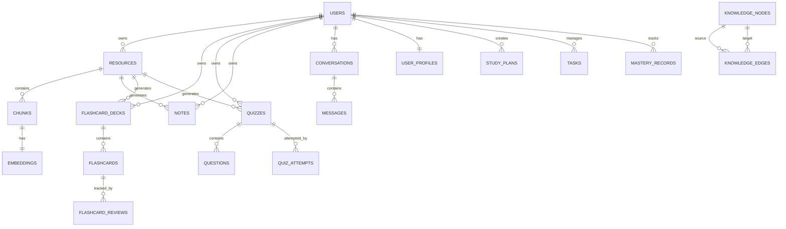
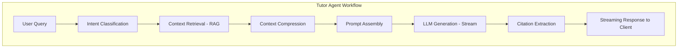
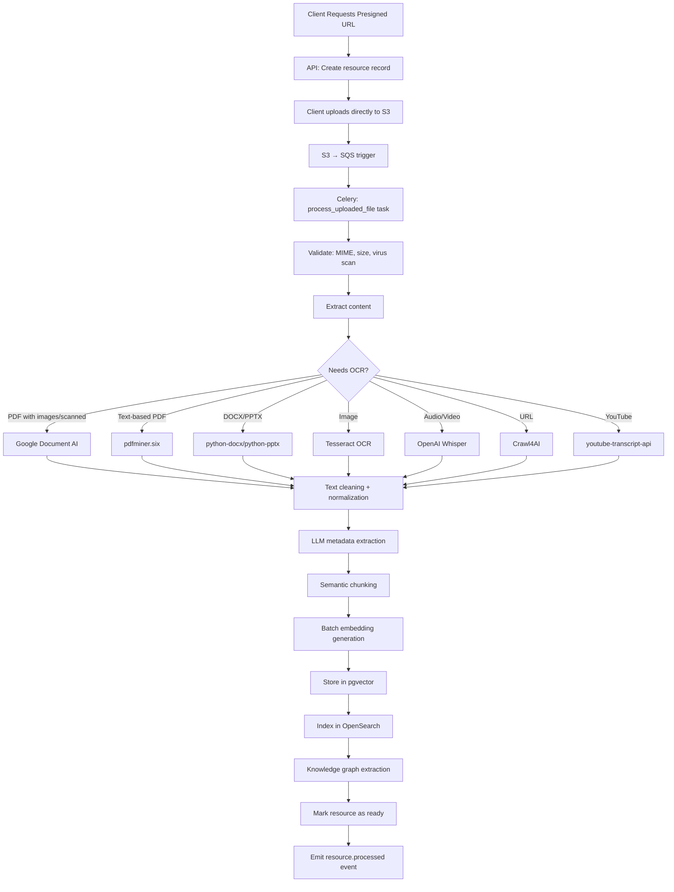
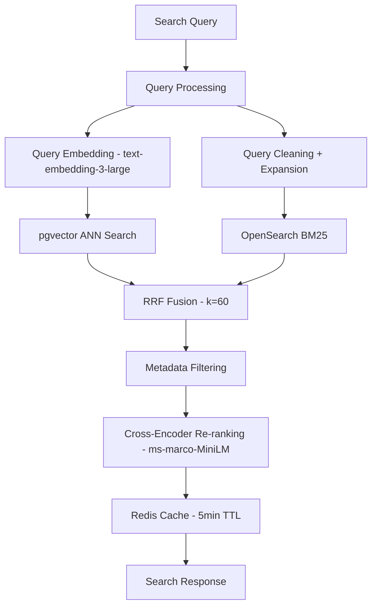

---

# 4. Database Design

## 4.1 Design Principles

- All primary keys are UUIDs (v4) — portable, no sequence conflicts in future sharding
- All tables have `created_at`, `updated_at`, `deleted_at` (soft delete)
- `deleted_at IS NULL` is added to every relevant query via SQLAlchemy event listeners
- All foreign keys have explicit indexes
- JSONB used for extensible metadata, never for queryable structured data
- Row-level security (RLS) enforced at application layer, not PostgreSQL (simpler for MVP, migratable to PostgreSQL RLS for multi-tenancy)
- All text search uses `tsvector` columns with GIN indexes

---

## 4.2 Naming Conventions

| Convention | Rule | Example |
|-----------|------|---------|
| Tables | `snake_case` plural | `study_sessions` |
| Columns | `snake_case` | `processing_status` |
| PKs | `id UUID` | `id` |
| FKs | `{table_singular}_id` | `user_id`, `resource_id` |
| Indexes | `idx_{table}_{columns}` | `idx_resources_user_id` |
| Unique | `uq_{table}_{columns}` | `uq_users_email` |
| Checks | `ck_{table}_{rule}` | `ck_flashcards_interval_positive` |

---

## 4.3 Complete Schema

### Users & Auth

```sql
-- Users
CREATE TABLE users (
    id              UUID PRIMARY KEY DEFAULT gen_random_uuid(),
    email           VARCHAR(255) NOT NULL,
    display_name    VARCHAR(255),
    avatar_url      VARCHAR(2048),
    auth_provider   VARCHAR(50) NOT NULL DEFAULT 'email',  -- 'email' | 'google'
    password_hash   VARCHAR(255),                           -- NULL for OAuth users
    is_active       BOOLEAN NOT NULL DEFAULT true,
    is_verified     BOOLEAN NOT NULL DEFAULT false,
    onboarding_done BOOLEAN NOT NULL DEFAULT false,
    timezone        VARCHAR(100) DEFAULT 'UTC',
    locale          VARCHAR(10) DEFAULT 'en',
    created_at      TIMESTAMPTZ NOT NULL DEFAULT now(),
    updated_at      TIMESTAMPTZ NOT NULL DEFAULT now(),
    deleted_at      TIMESTAMPTZ,
    CONSTRAINT uq_users_email UNIQUE (email)
);
CREATE INDEX idx_users_email ON users(email) WHERE deleted_at IS NULL;

-- OAuth Accounts (supports multiple providers per user)
CREATE TABLE oauth_accounts (
    id              UUID PRIMARY KEY DEFAULT gen_random_uuid(),
    user_id         UUID NOT NULL REFERENCES users(id) ON DELETE CASCADE,
    provider        VARCHAR(50) NOT NULL,
    provider_id     VARCHAR(255) NOT NULL,
    access_token    TEXT,
    refresh_token   TEXT,
    token_expires_at TIMESTAMPTZ,
    created_at      TIMESTAMPTZ NOT NULL DEFAULT now(),
    updated_at      TIMESTAMPTZ NOT NULL DEFAULT now(),
    CONSTRAINT uq_oauth_provider_id UNIQUE (provider, provider_id)
);
CREATE INDEX idx_oauth_accounts_user_id ON oauth_accounts(user_id);

-- Refresh Tokens
CREATE TABLE refresh_tokens (
    id          UUID PRIMARY KEY DEFAULT gen_random_uuid(),
    user_id     UUID NOT NULL REFERENCES users(id) ON DELETE CASCADE,
    token_hash  VARCHAR(255) NOT NULL,
    expires_at  TIMESTAMPTZ NOT NULL,
    revoked_at  TIMESTAMPTZ,
    user_agent  VARCHAR(500),
    ip_address  INET,
    created_at  TIMESTAMPTZ NOT NULL DEFAULT now(),
    CONSTRAINT uq_refresh_tokens_hash UNIQUE (token_hash)
);
CREATE INDEX idx_refresh_tokens_user_id ON refresh_tokens(user_id);
CREATE INDEX idx_refresh_tokens_token_hash ON refresh_tokens(token_hash);

-- User Profiles (extensible preferences)
CREATE TABLE user_profiles (
    id                      UUID PRIMARY KEY DEFAULT gen_random_uuid(),
    user_id                 UUID NOT NULL REFERENCES users(id) ON DELETE CASCADE,
    learning_goals          TEXT[],
    subjects                TEXT[],
    preferred_study_hours   JSONB DEFAULT '{}',  -- {"monday": [9,10,11], ...}
    difficulty_preference   VARCHAR(20) DEFAULT 'medium',
    learning_style          VARCHAR(50),
    ai_model_preference     VARCHAR(50),
    daily_study_target_mins INT DEFAULT 60,
    streak_count            INT DEFAULT 0,
    streak_last_date        DATE,
    created_at              TIMESTAMPTZ NOT NULL DEFAULT now(),
    updated_at              TIMESTAMPTZ NOT NULL DEFAULT now(),
    CONSTRAINT uq_user_profiles_user_id UNIQUE (user_id)
);
```

### Knowledge Hub

```sql
-- Folders
CREATE TABLE folders (
    id          UUID PRIMARY KEY DEFAULT gen_random_uuid(),
    user_id     UUID NOT NULL REFERENCES users(id) ON DELETE CASCADE,
    parent_id   UUID REFERENCES folders(id) ON DELETE CASCADE,
    name        VARCHAR(255) NOT NULL,
    color       VARCHAR(7),
    icon        VARCHAR(50),
    position    INT DEFAULT 0,
    created_at  TIMESTAMPTZ NOT NULL DEFAULT now(),
    updated_at  TIMESTAMPTZ NOT NULL DEFAULT now(),
    deleted_at  TIMESTAMPTZ
);
CREATE INDEX idx_folders_user_id ON folders(user_id) WHERE deleted_at IS NULL;
CREATE INDEX idx_folders_parent_id ON folders(parent_id);

-- Resources (all learning materials)
CREATE TABLE resources (
    id                  UUID PRIMARY KEY DEFAULT gen_random_uuid(),
    user_id             UUID NOT NULL REFERENCES users(id) ON DELETE CASCADE,
    folder_id           UUID REFERENCES folders(id) ON DELETE SET NULL,
    title               VARCHAR(500) NOT NULL,
    description         TEXT,
    file_type           VARCHAR(50) NOT NULL,
    -- pdf|docx|pptx|image|audio|video|url|youtube|bookmark
    storage_key         VARCHAR(1000),   -- S3 key
    source_url          VARCHAR(2048),   -- For URLs, YouTube
    thumbnail_key       VARCHAR(1000),
    file_size_bytes     BIGINT,
    page_count          INT,
    duration_seconds    INT,             -- For audio/video
    language            VARCHAR(10) DEFAULT 'en',
    processing_status   VARCHAR(20) NOT NULL DEFAULT 'pending',
    -- pending|processing|ready|failed
    processing_error    TEXT,
    chunk_count         INT DEFAULT 0,
    word_count          INT DEFAULT 0,
    topics              TEXT[],
    tags                TEXT[],
    metadata            JSONB DEFAULT '{}',
    search_vector       TSVECTOR,
    created_at          TIMESTAMPTZ NOT NULL DEFAULT now(),
    updated_at          TIMESTAMPTZ NOT NULL DEFAULT now(),
    deleted_at          TIMESTAMPTZ
);
CREATE INDEX idx_resources_user_id ON resources(user_id) WHERE deleted_at IS NULL;
CREATE INDEX idx_resources_folder_id ON resources(folder_id);
CREATE INDEX idx_resources_processing_status ON resources(processing_status);
CREATE INDEX idx_resources_file_type ON resources(file_type);
CREATE INDEX idx_resources_search_vector ON resources USING GIN(search_vector);
CREATE INDEX idx_resources_topics ON resources USING GIN(topics);
CREATE INDEX idx_resources_tags ON resources USING GIN(tags);

-- Chunks (processed content segments)
CREATE TABLE chunks (
    id              UUID PRIMARY KEY DEFAULT gen_random_uuid(),
    resource_id     UUID NOT NULL REFERENCES resources(id) ON DELETE CASCADE,
    user_id         UUID NOT NULL REFERENCES users(id) ON DELETE CASCADE,
    chunk_index     INT NOT NULL,
    content         TEXT NOT NULL,
    content_type    VARCHAR(50) DEFAULT 'text',  -- text|table|code|formula|image_caption
    page_number     INT,
    section_title   VARCHAR(500),
    word_count      INT,
    token_count     INT,
    metadata        JSONB DEFAULT '{}',
    search_vector   TSVECTOR,
    created_at      TIMESTAMPTZ NOT NULL DEFAULT now(),
    CONSTRAINT uq_chunks_resource_index UNIQUE (resource_id, chunk_index)
);
CREATE INDEX idx_chunks_resource_id ON chunks(resource_id);
CREATE INDEX idx_chunks_user_id ON chunks(user_id);
CREATE INDEX idx_chunks_search_vector ON chunks USING GIN(search_vector);

-- Embeddings (pgvector)
CREATE TABLE embeddings (
    id              UUID PRIMARY KEY DEFAULT gen_random_uuid(),
    chunk_id        UUID NOT NULL REFERENCES chunks(id) ON DELETE CASCADE,
    resource_id     UUID NOT NULL REFERENCES resources(id) ON DELETE CASCADE,
    user_id         UUID NOT NULL REFERENCES users(id) ON DELETE CASCADE,
    embedding       vector(3072) NOT NULL,   -- text-embedding-3-large dimensions
    model           VARCHAR(100) NOT NULL,
    created_at      TIMESTAMPTZ NOT NULL DEFAULT now(),
    CONSTRAINT uq_embeddings_chunk_id UNIQUE (chunk_id)
);
-- HNSW index for fast approximate nearest neighbor search
CREATE INDEX idx_embeddings_vector ON embeddings
    USING hnsw (embedding vector_cosine_ops)
    WITH (m = 16, ef_construction = 64);
CREATE INDEX idx_embeddings_user_id ON embeddings(user_id);
CREATE INDEX idx_embeddings_resource_id ON embeddings(resource_id);
```

### AI Notes

```sql
CREATE TABLE notes (
    id              UUID PRIMARY KEY DEFAULT gen_random_uuid(),
    user_id         UUID NOT NULL REFERENCES users(id) ON DELETE CASCADE,
    resource_id     UUID REFERENCES resources(id) ON DELETE SET NULL,
    title           VARCHAR(500) NOT NULL,
    note_type       VARCHAR(50) NOT NULL,
    -- summary|chapter_summary|cheat_sheet|formula_sheet|key_takeaways|
    -- mind_map|timeline|beginner|exam|interview
    content         TEXT NOT NULL,      -- Markdown
    content_json    JSONB,              -- Structured for mind maps, timelines
    word_count      INT,
    model_used      VARCHAR(100),
    prompt_tokens   INT,
    completion_tokens INT,
    is_pinned       BOOLEAN DEFAULT false,
    search_vector   TSVECTOR,
    created_at      TIMESTAMPTZ NOT NULL DEFAULT now(),
    updated_at      TIMESTAMPTZ NOT NULL DEFAULT now(),
    deleted_at      TIMESTAMPTZ
);
CREATE INDEX idx_notes_user_id ON notes(user_id) WHERE deleted_at IS NULL;
CREATE INDEX idx_notes_resource_id ON notes(resource_id);
CREATE INDEX idx_notes_note_type ON notes(note_type);
CREATE INDEX idx_notes_search_vector ON notes USING GIN(search_vector);
```

### Flashcards

```sql
CREATE TABLE flashcard_decks (
    id              UUID PRIMARY KEY DEFAULT gen_random_uuid(),
    user_id         UUID NOT NULL REFERENCES users(id) ON DELETE CASCADE,
    resource_id     UUID REFERENCES resources(id) ON DELETE SET NULL,
    title           VARCHAR(500) NOT NULL,
    description     TEXT,
    is_ai_generated BOOLEAN DEFAULT true,
    card_count      INT DEFAULT 0,
    mastery_percent FLOAT DEFAULT 0,
    tags            TEXT[],
    created_at      TIMESTAMPTZ NOT NULL DEFAULT now(),
    updated_at      TIMESTAMPTZ NOT NULL DEFAULT now(),
    deleted_at      TIMESTAMPTZ
);
CREATE INDEX idx_flashcard_decks_user_id ON flashcard_decks(user_id) WHERE deleted_at IS NULL;
CREATE INDEX idx_flashcard_decks_resource_id ON flashcard_decks(resource_id);

CREATE TABLE flashcards (
    id              UUID PRIMARY KEY DEFAULT gen_random_uuid(),
    deck_id         UUID NOT NULL REFERENCES flashcard_decks(id) ON DELETE CASCADE,
    user_id         UUID NOT NULL REFERENCES users(id) ON DELETE CASCADE,
    card_type       VARCHAR(20) DEFAULT 'basic',  -- basic|cloze|image
    front           TEXT NOT NULL,
    back            TEXT NOT NULL,
    image_url       VARCHAR(2048),
    cloze_template  TEXT,           -- For cloze deletion cards
    tags            TEXT[],
    -- Spaced Repetition (SM-2 algorithm)
    ease_factor     FLOAT DEFAULT 2.5,
    interval_days   FLOAT DEFAULT 1.0,
    repetitions     INT DEFAULT 0,
    next_review_at  TIMESTAMPTZ DEFAULT now(),
    last_reviewed_at TIMESTAMPTZ,
    difficulty      VARCHAR(20),    -- easy|medium|hard|again
    created_at      TIMESTAMPTZ NOT NULL DEFAULT now(),
    updated_at      TIMESTAMPTZ NOT NULL DEFAULT now(),
    deleted_at      TIMESTAMPTZ,
    CONSTRAINT ck_flashcards_interval_positive CHECK (interval_days > 0)
);
CREATE INDEX idx_flashcards_deck_id ON flashcards(deck_id) WHERE deleted_at IS NULL;
CREATE INDEX idx_flashcards_user_id ON flashcards(user_id);
CREATE INDEX idx_flashcards_next_review ON flashcards(user_id, next_review_at)
    WHERE deleted_at IS NULL;

CREATE TABLE flashcard_reviews (
    id              UUID PRIMARY KEY DEFAULT gen_random_uuid(),
    flashcard_id    UUID NOT NULL REFERENCES flashcards(id) ON DELETE CASCADE,
    user_id         UUID NOT NULL REFERENCES users(id) ON DELETE CASCADE,
    rating          INT NOT NULL,  -- 1=Again, 2=Hard, 3=Good, 4=Easy
    response_time_ms INT,
    ease_before     FLOAT,
    interval_before FLOAT,
    ease_after      FLOAT,
    interval_after  FLOAT,
    reviewed_at     TIMESTAMPTZ NOT NULL DEFAULT now()
);
CREATE INDEX idx_flashcard_reviews_flashcard_id ON flashcard_reviews(flashcard_id);
CREATE INDEX idx_flashcard_reviews_user_id ON flashcard_reviews(user_id);
CREATE INDEX idx_flashcard_reviews_reviewed_at ON flashcard_reviews(user_id, reviewed_at);
```

### Quizzes

```sql
CREATE TABLE quizzes (
    id              UUID PRIMARY KEY DEFAULT gen_random_uuid(),
    user_id         UUID NOT NULL REFERENCES users(id) ON DELETE CASCADE,
    resource_id     UUID REFERENCES resources(id) ON DELETE SET NULL,
    title           VARCHAR(500) NOT NULL,
    quiz_type       VARCHAR(50) NOT NULL,   -- mcq|mixed|adaptive|timed
    difficulty      VARCHAR(20) DEFAULT 'medium',
    question_count  INT DEFAULT 10,
    time_limit_mins INT,
    is_ai_generated BOOLEAN DEFAULT true,
    tags            TEXT[],
    created_at      TIMESTAMPTZ NOT NULL DEFAULT now(),
    updated_at      TIMESTAMPTZ NOT NULL DEFAULT now(),
    deleted_at      TIMESTAMPTZ
);

CREATE TABLE questions (
    id              UUID PRIMARY KEY DEFAULT gen_random_uuid(),
    quiz_id         UUID NOT NULL REFERENCES quizzes(id) ON DELETE CASCADE,
    user_id         UUID NOT NULL REFERENCES users(id) ON DELETE CASCADE,
    question_type   VARCHAR(50) NOT NULL,
    -- mcq|true_false|fill_blank|short_answer|long_answer|coding|numerical
    content         TEXT NOT NULL,
    options         JSONB,          -- For MCQ: [{"id":"a","text":"...","is_correct":true}]
    correct_answer  TEXT,
    explanation     TEXT,
    difficulty      VARCHAR(20) DEFAULT 'medium',
    topics          TEXT[],
    chunk_ids       UUID[],         -- Source chunks for this question
    position        INT NOT NULL,
    created_at      TIMESTAMPTZ NOT NULL DEFAULT now()
);
CREATE INDEX idx_questions_quiz_id ON questions(quiz_id);

CREATE TABLE quiz_attempts (
    id              UUID PRIMARY KEY DEFAULT gen_random_uuid(),
    quiz_id         UUID NOT NULL REFERENCES quizzes(id) ON DELETE CASCADE,
    user_id         UUID NOT NULL REFERENCES users(id) ON DELETE CASCADE,
    status          VARCHAR(20) DEFAULT 'in_progress',  -- in_progress|completed|abandoned
    score_percent   FLOAT,
    correct_count   INT DEFAULT 0,
    total_questions INT NOT NULL,
    time_taken_secs INT,
    started_at      TIMESTAMPTZ NOT NULL DEFAULT now(),
    completed_at    TIMESTAMPTZ,
    answers         JSONB DEFAULT '[]'  -- [{question_id, answer, is_correct, time_ms}]
);
CREATE INDEX idx_quiz_attempts_user_id ON quiz_attempts(user_id);
CREATE INDEX idx_quiz_attempts_quiz_id ON quiz_attempts(quiz_id);
CREATE INDEX idx_quiz_attempts_completed_at ON quiz_attempts(user_id, completed_at);
```

### Study Planning

```sql
CREATE TABLE study_plans (
    id              UUID PRIMARY KEY DEFAULT gen_random_uuid(),
    user_id         UUID NOT NULL REFERENCES users(id) ON DELETE CASCADE,
    title           VARCHAR(255) NOT NULL,
    plan_type       VARCHAR(20) NOT NULL,   -- daily|weekly|semester
    start_date      DATE NOT NULL,
    end_date        DATE NOT NULL,
    goal            TEXT,
    is_active       BOOLEAN DEFAULT true,
    metadata        JSONB DEFAULT '{}',
    created_at      TIMESTAMPTZ NOT NULL DEFAULT now(),
    updated_at      TIMESTAMPTZ NOT NULL DEFAULT now()
);
CREATE INDEX idx_study_plans_user_id ON study_plans(user_id);

CREATE TABLE study_sessions (
    id              UUID PRIMARY KEY DEFAULT gen_random_uuid(),
    user_id         UUID NOT NULL REFERENCES users(id) ON DELETE CASCADE,
    plan_id         UUID REFERENCES study_plans(id) ON DELETE SET NULL,
    resource_id     UUID REFERENCES resources(id) ON DELETE SET NULL,
    title           VARCHAR(255),
    session_type    VARCHAR(50),    -- reading|flashcards|quiz|notes|revision
    planned_start   TIMESTAMPTZ,
    planned_end     TIMESTAMPTZ,
    actual_start    TIMESTAMPTZ,
    actual_end      TIMESTAMPTZ,
    duration_mins   INT,
    status          VARCHAR(20) DEFAULT 'planned',  -- planned|active|completed|skipped
    notes           TEXT,
    created_at      TIMESTAMPTZ NOT NULL DEFAULT now(),
    updated_at      TIMESTAMPTZ NOT NULL DEFAULT now()
);
CREATE INDEX idx_study_sessions_user_id ON study_sessions(user_id);
CREATE INDEX idx_study_sessions_planned_start ON study_sessions(user_id, planned_start);
CREATE INDEX idx_study_sessions_status ON study_sessions(status);

CREATE TABLE calendar_events (
    id              UUID PRIMARY KEY DEFAULT gen_random_uuid(),
    user_id         UUID NOT NULL REFERENCES users(id) ON DELETE CASCADE,
    title           VARCHAR(500) NOT NULL,
    description     TEXT,
    event_type      VARCHAR(50),    -- exam|deadline|study_session|revision|other
    start_at        TIMESTAMPTZ NOT NULL,
    end_at          TIMESTAMPTZ,
    all_day         BOOLEAN DEFAULT false,
    location        VARCHAR(500),
    resource_id     UUID REFERENCES resources(id) ON DELETE SET NULL,
    external_id     VARCHAR(255),   -- Google/Outlook Calendar ID
    external_source VARCHAR(50),    -- google|outlook
    reminder_mins   INT[],          -- [30, 60, 1440]
    recurrence_rule TEXT,           -- RRULE string
    color           VARCHAR(7),
    created_at      TIMESTAMPTZ NOT NULL DEFAULT now(),
    updated_at      TIMESTAMPTZ NOT NULL DEFAULT now(),
    deleted_at      TIMESTAMPTZ
);
CREATE INDEX idx_calendar_events_user_id ON calendar_events(user_id) WHERE deleted_at IS NULL;
CREATE INDEX idx_calendar_events_start_at ON calendar_events(user_id, start_at);
CREATE INDEX idx_calendar_events_event_type ON calendar_events(event_type);
```

### Tasks & Mastery

```sql
CREATE TABLE tasks (
    id              UUID PRIMARY KEY DEFAULT gen_random_uuid(),
    user_id         UUID NOT NULL REFERENCES users(id) ON DELETE CASCADE,
    resource_id     UUID REFERENCES resources(id) ON DELETE SET NULL,
    title           VARCHAR(500) NOT NULL,
    description     TEXT,
    task_type       VARCHAR(50),    -- assignment|reading|revision|project|other
    priority        VARCHAR(20) DEFAULT 'medium',   -- low|medium|high|urgent
    status          VARCHAR(20) DEFAULT 'todo',     -- todo|in_progress|done|cancelled
    due_date        DATE,
    estimated_mins  INT,
    actual_mins     INT,
    tags            TEXT[],
    completed_at    TIMESTAMPTZ,
    created_at      TIMESTAMPTZ NOT NULL DEFAULT now(),
    updated_at      TIMESTAMPTZ NOT NULL DEFAULT now(),
    deleted_at      TIMESTAMPTZ
);
CREATE INDEX idx_tasks_user_id ON tasks(user_id) WHERE deleted_at IS NULL;
CREATE INDEX idx_tasks_due_date ON tasks(user_id, due_date);
CREATE INDEX idx_tasks_status ON tasks(status);

-- Mastery tracking per concept/topic
CREATE TABLE mastery_records (
    id                  UUID PRIMARY KEY DEFAULT gen_random_uuid(),
    user_id             UUID NOT NULL REFERENCES users(id) ON DELETE CASCADE,
    resource_id         UUID REFERENCES resources(id) ON DELETE CASCADE,
    topic               VARCHAR(500) NOT NULL,
    mastery_score       FLOAT DEFAULT 0,    -- 0.0 to 1.0
    confidence_level    VARCHAR(20) DEFAULT 'unknown',
    -- unknown|low|medium|high|mastered
    last_tested_at      TIMESTAMPTZ,
    next_review_at      TIMESTAMPTZ,
    review_count        INT DEFAULT 0,
    correct_count       INT DEFAULT 0,
    retention_curve     JSONB DEFAULT '[]', -- [{date, score}]
    created_at          TIMESTAMPTZ NOT NULL DEFAULT now(),
    updated_at          TIMESTAMPTZ NOT NULL DEFAULT now(),
    CONSTRAINT uq_mastery_user_resource_topic UNIQUE (user_id, resource_id, topic)
);
CREATE INDEX idx_mastery_records_user_id ON mastery_records(user_id);
CREATE INDEX idx_mastery_records_next_review ON mastery_records(user_id, next_review_at);
CREATE INDEX idx_mastery_records_score ON mastery_records(user_id, mastery_score);
```

### Analytics

```sql
CREATE TABLE analytics_daily (
    id              UUID PRIMARY KEY DEFAULT gen_random_uuid(),
    user_id         UUID NOT NULL REFERENCES users(id) ON DELETE CASCADE,
    date            DATE NOT NULL,
    study_minutes   INT DEFAULT 0,
    resources_read  INT DEFAULT 0,
    cards_reviewed  INT DEFAULT 0,
    quizzes_taken   INT DEFAULT 0,
    ai_queries      INT DEFAULT 0,
    streak_day      INT DEFAULT 0,
    avg_score       FLOAT,
    topics_studied  TEXT[],
    created_at      TIMESTAMPTZ NOT NULL DEFAULT now(),
    updated_at      TIMESTAMPTZ NOT NULL DEFAULT now(),
    CONSTRAINT uq_analytics_daily_user_date UNIQUE (user_id, date)
);
CREATE INDEX idx_analytics_daily_user_id ON analytics_daily(user_id);
CREATE INDEX idx_analytics_daily_date ON analytics_daily(user_id, date DESC);
```

### Knowledge Graph

```sql
CREATE TABLE knowledge_nodes (
    id          UUID PRIMARY KEY DEFAULT gen_random_uuid(),
    user_id     UUID NOT NULL REFERENCES users(id) ON DELETE CASCADE,
    resource_id UUID REFERENCES resources(id) ON DELETE CASCADE,
    label       VARCHAR(500) NOT NULL,
    node_type   VARCHAR(50) DEFAULT 'concept',  -- concept|topic|formula|theorem
    description TEXT,
    properties  JSONB DEFAULT '{}',
    created_at  TIMESTAMPTZ NOT NULL DEFAULT now()
);
CREATE INDEX idx_knowledge_nodes_user_id ON knowledge_nodes(user_id);
CREATE INDEX idx_knowledge_nodes_resource_id ON knowledge_nodes(resource_id);
CREATE INDEX idx_knowledge_nodes_label ON knowledge_nodes(user_id, label);

CREATE TABLE knowledge_edges (
    id              UUID PRIMARY KEY DEFAULT gen_random_uuid(),
    user_id         UUID NOT NULL REFERENCES users(id) ON DELETE CASCADE,
    source_node_id  UUID NOT NULL REFERENCES knowledge_nodes(id) ON DELETE CASCADE,
    target_node_id  UUID NOT NULL REFERENCES knowledge_nodes(id) ON DELETE CASCADE,
    relation_type   VARCHAR(100),  -- requires|explains|contrasts|extends|example_of
    weight          FLOAT DEFAULT 1.0,
    created_at      TIMESTAMPTZ NOT NULL DEFAULT now(),
    CONSTRAINT uq_knowledge_edges UNIQUE (user_id, source_node_id, target_node_id, relation_type)
);
CREATE INDEX idx_knowledge_edges_source ON knowledge_edges(source_node_id);
CREATE INDEX idx_knowledge_edges_target ON knowledge_edges(target_node_id);
CREATE INDEX idx_knowledge_edges_user_id ON knowledge_edges(user_id);
```

### Notifications & Conversations

```sql
CREATE TABLE notifications (
    id              UUID PRIMARY KEY DEFAULT gen_random_uuid(),
    user_id         UUID NOT NULL REFERENCES users(id) ON DELETE CASCADE,
    type            VARCHAR(50) NOT NULL,
    -- study_reminder|revision_alert|deadline|streak|weekly_report|ai_suggestion
    title           VARCHAR(255) NOT NULL,
    body            TEXT,
    action_url      VARCHAR(2048),
    is_read         BOOLEAN DEFAULT false,
    sent_via        TEXT[],     -- ['in_app', 'email', 'push']
    metadata        JSONB DEFAULT '{}',
    scheduled_at    TIMESTAMPTZ,
    sent_at         TIMESTAMPTZ,
    read_at         TIMESTAMPTZ,
    created_at      TIMESTAMPTZ NOT NULL DEFAULT now()
);
CREATE INDEX idx_notifications_user_id ON notifications(user_id);
CREATE INDEX idx_notifications_is_read ON notifications(user_id, is_read);
CREATE INDEX idx_notifications_scheduled_at ON notifications(scheduled_at)
    WHERE sent_at IS NULL;

CREATE TABLE conversations (
    id              UUID PRIMARY KEY DEFAULT gen_random_uuid(),
    user_id         UUID NOT NULL REFERENCES users(id) ON DELETE CASCADE,
    title           VARCHAR(255),
    context_type    VARCHAR(50) DEFAULT 'workspace',  -- tutor|workspace|research
    resource_ids    UUID[],
    message_count   INT DEFAULT 0,
    total_tokens    INT DEFAULT 0,
    model_used      VARCHAR(100),
    created_at      TIMESTAMPTZ NOT NULL DEFAULT now(),
    updated_at      TIMESTAMPTZ NOT NULL DEFAULT now(),
    deleted_at      TIMESTAMPTZ
);
CREATE INDEX idx_conversations_user_id ON conversations(user_id) WHERE deleted_at IS NULL;

CREATE TABLE messages (
    id              UUID PRIMARY KEY DEFAULT gen_random_uuid(),
    conversation_id UUID NOT NULL REFERENCES conversations(id) ON DELETE CASCADE,
    user_id         UUID NOT NULL REFERENCES users(id) ON DELETE CASCADE,
    role            VARCHAR(20) NOT NULL,   -- user|assistant|system
    content         TEXT NOT NULL,
    citations       JSONB DEFAULT '[]',
    tokens_used     INT,
    model_used      VARCHAR(100),
    latency_ms      INT,
    created_at      TIMESTAMPTZ NOT NULL DEFAULT now()
);
CREATE INDEX idx_messages_conversation_id ON messages(conversation_id);
CREATE INDEX idx_messages_user_id ON messages(user_id);
```

---

## 4.4 ER Diagram (Core)



---

## 4.5 Migration Strategy

```python
# alembic/env.py
from alembic import context
from app.core.database import Base
from app.modules.users.models import *      # noqa
from app.modules.knowledge.models import *  # noqa
# ... all models

target_metadata = Base.metadata

# Convention: one migration per logical change
# Never squash migrations in production
# Always test down migrations locally before merging
```

**Migration naming convention:** `{timestamp}_{verb}_{table}_{description}.py`
Examples: `20240115_create_users_table.py`, `20240120_add_users_timezone_column.py`

**Zero-downtime migration rules:**
1. Never rename columns — add new + deprecate old
2. Never change column types directly — add new column, backfill, swap
3. Add indexes `CONCURRENTLY` in production
4. Drop columns only after 2 release cycles

---

## 4.6 Partitioning Strategy

Apply table partitioning when a table exceeds 50M rows:

```sql
-- Partition chunks by user_id hash for query locality
-- (Applied when table > 50M rows)
CREATE TABLE chunks_partitioned (
    LIKE chunks INCLUDING ALL
) PARTITION BY HASH (user_id);

CREATE TABLE chunks_p0 PARTITION OF chunks_partitioned FOR VALUES WITH (MODULUS 4, REMAINDER 0);
CREATE TABLE chunks_p1 PARTITION OF chunks_partitioned FOR VALUES WITH (MODULUS 4, REMAINDER 1);
CREATE TABLE chunks_p2 PARTITION OF chunks_partitioned FOR VALUES WITH (MODULUS 4, REMAINDER 2);
CREATE TABLE chunks_p3 PARTITION OF chunks_partitioned FOR VALUES WITH (MODULUS 4, REMAINDER 3);

-- Partition analytics_daily by date range
CREATE TABLE analytics_daily_partitioned (
    LIKE analytics_daily INCLUDING ALL
) PARTITION BY RANGE (date);
```

---

# 5. AI Architecture

## 5.1 LangGraph Workflow Architecture

LangGraph is used for all multi-step agent workflows. Each agent is a LangGraph StateGraph.



```python
# ai/agents/tutor_agent.py
from langgraph.graph import StateGraph, END
from typing import TypedDict, Annotated
import operator

class TutorState(TypedDict):
    user_id: str
    conversation_id: str
    query: str
    context_ids: list[str]
    intent: str | None
    retrieved_chunks: list[dict]
    compressed_context: str | None
    prompt: str | None
    response_tokens: Annotated[list[str], operator.add]
    citations: list[dict]
    error: str | None

async def classify_intent(state: TutorState) -> TutorState:
    """Classify query intent for routing"""
    # Quick classification using GPT-4o-mini for cost efficiency
    intent = await classify_query_intent(state["query"])
    return {**state, "intent": intent}

async def retrieve_context(state: TutorState) -> TutorState:
    """Hybrid RAG retrieval"""
    retriever = HybridRetriever(
        user_id=state["user_id"],
        resource_ids=state["context_ids"]
    )
    chunks = await retriever.retrieve(state["query"], k=15)
    return {**state, "retrieved_chunks": chunks}

async def compress_context(state: TutorState) -> TutorState:
    """Compress context to fit token budget"""
    if len(state["retrieved_chunks"]) == 0:
        return {**state, "compressed_context": ""}
    compressor = ContextCompressor(max_tokens=4096)
    compressed = await compressor.compress(state["query"], state["retrieved_chunks"])
    return {**state, "compressed_context": compressed}

async def generate_response(state: TutorState) -> TutorState:
    """Stream response from LLM"""
    prompt = build_tutor_prompt(state["query"], state["compressed_context"])
    tokens = []
    async for token in litellm_stream(prompt, model="gpt-4o"):
        tokens.append(token)
        # Publish to Redis for WebSocket forwarding
        await publish_token(state["conversation_id"], token)

    full_response = "".join(tokens)
    citations = extract_citations(full_response, state["retrieved_chunks"])
    return {**state, "response_tokens": tokens, "citations": citations}

# Build the graph
workflow = StateGraph(TutorState)
workflow.add_node("classify_intent", classify_intent)
workflow.add_node("retrieve_context", retrieve_context)
workflow.add_node("compress_context", compress_context)
workflow.add_node("generate_response", generate_response)

workflow.set_entry_point("classify_intent")
workflow.add_edge("classify_intent", "retrieve_context")
workflow.add_edge("retrieve_context", "compress_context")
workflow.add_edge("compress_context", "generate_response")
workflow.add_edge("generate_response", END)

tutor_graph = workflow.compile()
```

---

## 5.2 LiteLLM Configuration

```yaml
# litellm_config.yaml
model_list:
  # Primary: GPT-4o for tutor and complex reasoning
  - model_name: gpt-4o
    litellm_params:
      model: openai/gpt-4o
      api_key: os.environ/OPENAI_API_KEY
      max_tokens: 4096
      temperature: 0.7
      caching: true

  # Cost-efficient: GPT-4o-mini for classification, simple tasks
  - model_name: gpt-4o-mini
    litellm_params:
      model: openai/gpt-4o-mini
      api_key: os.environ/OPENAI_API_KEY
      max_tokens: 2048
      caching: true

  # Long context: Claude 3.5 for large documents
  - model_name: claude-long-context
    litellm_params:
      model: anthropic/claude-sonnet-4-6
      api_key: os.environ/ANTHROPIC_API_KEY
      max_tokens: 8192

  # Fallback: Gemini Pro
  - model_name: gemini-pro
    litellm_params:
      model: gemini/gemini-1.5-pro
      api_key: os.environ/GOOGLE_AI_API_KEY
      max_tokens: 4096

router_settings:
  routing_strategy: "usage-based-routing-v2"
  num_retries: 3
  retry_after: 0.5
  fallbacks:
    - model: gpt-4o
      fallback: gemini-pro
    - model: claude-long-context
      fallback: gpt-4o

general_settings:
  master_key: os.environ/LITELLM_MASTER_KEY
  database_url: os.environ/DATABASE_URL
  store_model_in_db: true
  disable_spend_logs: false

litellm_settings:
  cache: true
  cache_params:
    type: redis
    host: os.environ/REDIS_HOST
    ttl: 3600
  callbacks:
    - langfuse  # Observability
```

---

## 5.3 Model Routing Strategy

| Use Case | Model | Rationale |
|----------|-------|-----------|
| Intent classification | `gpt-4o-mini` | Fast, cheap, sufficient for classification |
| Flashcard generation | `gpt-4o-mini` | Structured output, cost efficient |
| Quiz generation | `gpt-4o-mini` | Structured JSON output |
| Tutor Q&A (short context) | `gpt-4o` | Best reasoning quality |
| Tutor Q&A (long context) | `claude-long-context` | 200K context window |
| Note generation | `gpt-4o` | Writing quality matters |
| Study plan generation | `gpt-4o` | Reasoning + planning |
| Embedding | `text-embedding-3-large` | Best semantic quality |

---

## 5.4 Prompt Templates

```python
# ai/prompts/tutor.py
from string import Template

TUTOR_SYSTEM_PROMPT = """You are StudyOS Tutor, an expert educational AI assistant.
You have access to the student's learning materials and must answer questions using them.

Guidelines:
- Always cite sources using [SOURCE:chunk_id] format inline
- Explain concepts at the student's level
- Break down complex topics step by step
- Use analogies and examples when helpful
- If information isn't in the provided context, say so clearly
- Never hallucinate or invent information
- For mathematical content, use LaTeX notation: $formula$ for inline, $$formula$$ for block

Student Profile:
- Difficulty preference: {difficulty_level}
- Learning style: {learning_style}
"""

TUTOR_USER_PROMPT = """Using the following study materials as context, answer the question:

=== STUDY MATERIALS ===
{context}
======================

Question: {query}

Previous conversation summary: {conversation_summary}
"""

# ai/prompts/flashcard.py
FLASHCARD_SYSTEM_PROMPT = """You are an expert at creating educational flashcards.
Generate flashcards that:
- Test one concept per card
- Use clear, unambiguous language
- Include both definition AND application questions
- Vary question types (definition, example, comparison, application)
- Use cloze format for factual recall: "The {{blank}} is responsible for..."

Return a JSON array with this exact structure:
[
  {
    "front": "Question or prompt",
    "back": "Answer or explanation",
    "card_type": "basic|cloze",
    "tags": ["topic1", "topic2"]
  }
]
"""
```

---

## 5.5 Memory Architecture

Three-layer memory system for AI agents:

```python
# ai/memory/short_term.py
class ShortTermMemory:
    """In-conversation message buffer. Stored in Redis."""
    def __init__(self, redis, conversation_id: str, max_tokens: int = 4000):
        self.redis = redis
        self.key = f"memory:short:{conversation_id}"
        self.max_tokens = max_tokens

    async def add(self, role: str, content: str) -> None:
        msg = {"role": role, "content": content, "timestamp": time.time()}
        await self.redis.lpush(self.key, json.dumps(msg))
        await self.redis.expire(self.key, 86400)  # 24 hour TTL
        await self._trim_to_token_budget()

    async def get_messages(self) -> list[dict]:
        raw = await self.redis.lrange(self.key, 0, -1)
        return [json.loads(m) for m in reversed(raw)]

    async def _trim_to_token_budget(self) -> None:
        msgs = await self.get_messages()
        total = sum(estimate_tokens(m["content"]) for m in msgs)
        while total > self.max_tokens and msgs:
            removed = msgs.pop(0)
            total -= estimate_tokens(removed["content"])
            await self.redis.rpop(self.key)


# ai/memory/long_term.py
class LongTermMemory:
    """Cross-session user knowledge. Stored in PostgreSQL."""
    def __init__(self, db, user_id: str):
        self.db = db
        self.user_id = user_id

    async def get_user_context(self) -> str:
        """Retrieve user profile + mastery summary for system prompt injection"""
        profile = await self.db.fetchrow(
            "SELECT * FROM user_profiles WHERE user_id = $1", self.user_id
        )
        weak_topics = await self.db.fetch(
            "SELECT topic FROM mastery_records WHERE user_id = $1 AND mastery_score < 0.4 LIMIT 10",
            self.user_id
        )
        return f"""
User Profile:
- Learning goals: {profile['learning_goals']}
- Subjects: {profile['subjects']}
- Weak areas: {[r['topic'] for r in weak_topics]}
"""

# ai/memory/episodic.py
class EpisodicMemory:
    """Session summaries. Summarize old conversations to maintain context cheaply."""
    async def summarize_conversation(self, conversation_id: str, messages: list[dict]) -> str:
        """Use GPT-4o-mini to summarize a conversation when it gets too long"""
        summary = await litellm_complete(
            model="gpt-4o-mini",
            messages=[
                {"role": "system", "content": "Summarize this educational conversation in 100 words, preserving key questions and answers."},
                {"role": "user", "content": json.dumps(messages)}
            ]
        )
        await self.db.execute(
            "INSERT INTO conversation_summaries (conversation_id, summary) VALUES ($1, $2)"
            "ON CONFLICT (conversation_id) DO UPDATE SET summary = $2",
            conversation_id, summary
        )
        return summary
```

---

## 5.6 RAG Implementation

```python
# ai/rag/retriever.py
from pgvector.asyncpg import register_vector
import asyncpg, numpy as np

class HybridRetriever:
    def __init__(self, user_id: str, resource_ids: list[str] | None = None):
        self.user_id = user_id
        self.resource_ids = resource_ids

    async def retrieve(self, query: str, k: int = 15) -> list[dict]:
        # Step 1: Generate query embedding
        query_embedding = await generate_embedding(query)

        # Step 2: HyDE - generate hypothetical answer for better embedding
        hyde_doc = await generate_hyde_document(query)
        hyde_embedding = await generate_embedding(hyde_doc)
        # Average the two embeddings
        combined_embedding = np.mean([query_embedding, hyde_embedding], axis=0).tolist()

        # Step 3: Vector search via pgvector
        vector_results = await self._vector_search(combined_embedding, k=k*2)

        # Step 4: BM25 search via OpenSearch
        bm25_results = await self._bm25_search(query, k=k*2)

        # Step 5: RRF merge
        merged = reciprocal_rank_fusion([vector_results, bm25_results], k=60)

        return merged[:k]

    async def _vector_search(self, embedding: list[float], k: int) -> list[dict]:
        query = """
            SELECT c.id, c.content, c.page_number, c.section_title, c.resource_id,
                   1 - (e.embedding <=> $1::vector) AS score
            FROM embeddings e
            JOIN chunks c ON e.chunk_id = c.id
            WHERE e.user_id = $2
            {resource_filter}
            ORDER BY e.embedding <=> $1::vector
            LIMIT $3
        """
        resource_filter = "AND e.resource_id = ANY($4)" if self.resource_ids else ""
        # ... execute and return
        return results

    async def _bm25_search(self, query: str, k: int) -> list[dict]:
        # OpenSearch query
        body = {
            "query": {
                "bool": {
                    "must": [
                        {"match": {"content": {"query": query, "fuzziness": "AUTO"}}}
                    ],
                    "filter": [
                        {"term": {"user_id": self.user_id}},
                    ]
                }
            },
            "size": k
        }
        if self.resource_ids:
            body["query"]["bool"]["filter"].append({"terms": {"resource_id": self.resource_ids}})

        response = await opensearch_client.search(index="studyos-chunks", body=body)
        return [{"id": hit["_id"], "content": hit["_source"]["content"],
                 "score": hit["_score"], **hit["_source"]} for hit in response["hits"]["hits"]]


def reciprocal_rank_fusion(result_lists: list[list[dict]], k: int = 60) -> list[dict]:
    """Merge multiple ranked lists using RRF score = 1/(k + rank)"""
    scores = {}
    for results in result_lists:
        for rank, doc in enumerate(results):
            doc_id = doc["id"]
            if doc_id not in scores:
                scores[doc_id] = {"doc": doc, "score": 0}
            scores[doc_id]["score"] += 1 / (k + rank + 1)

    return [v["doc"] for v in sorted(scores.values(), key=lambda x: x["score"], reverse=True)]
```

---

## 5.7 Token Budget Management

```python
# ai/token_budget.py
class TokenBudgetManager:
    BUDGETS = {
        "tutor": {"context": 4096, "response": 2048, "total": 8192},
        "notes": {"context": 8192, "response": 4096, "total": 16000},
        "flashcards": {"context": 3000, "response": 2000, "total": 6000},
        "quiz": {"context": 3000, "response": 2000, "total": 6000},
        "planner": {"context": 2000, "response": 1500, "total": 4000},
    }

    def get_budget(self, agent_type: str) -> dict:
        return self.BUDGETS.get(agent_type, self.BUDGETS["tutor"])

    def check_cost(self, model: str, input_tokens: int, output_tokens: int) -> float:
        PRICING = {
            "gpt-4o": {"input": 0.0025, "output": 0.01},       # per 1K tokens
            "gpt-4o-mini": {"input": 0.00015, "output": 0.0006},
            "claude-sonnet-4-6": {"input": 0.003, "output": 0.015},
        }
        p = PRICING.get(model, PRICING["gpt-4o"])
        return (input_tokens * p["input"] + output_tokens * p["output"]) / 1000
```

---

# 6. Knowledge Pipeline

## 6.1 Pipeline Overview



---

## 6.2 Chunking Strategy

**Decision:** Hierarchical semantic chunking (not fixed-size).

Rationale: Fixed-size chunking destroys semantic boundaries. Hierarchical chunking preserves section structure, improving retrieval precision.

```python
# modules/knowledge/chunkers/hierarchical.py
from langchain.text_splitter import RecursiveCharacterTextSplitter

class HierarchicalChunker:
    """
    Level 1: Document → Sections (by headers)
    Level 2: Sections → Paragraphs (~500 tokens)
    Level 3: Paragraphs → Sentences (for overlap)

    Each chunk stores: content, section_title, page_number, chunk_index, parent_id
    Retrieval gets the chunk + retrieves parent section for additional context
    """
    CHUNK_SIZE = 500      # tokens
    CHUNK_OVERLAP = 50    # tokens
    MIN_CHUNK_SIZE = 50   # discard tiny chunks

    def chunk(self, text: str, metadata: dict) -> list[dict]:
        # Split by headers first
        sections = self._split_by_headers(text)
        chunks = []

        for section_idx, section in enumerate(sections):
            # Split each section into paragraphs
            para_splitter = RecursiveCharacterTextSplitter(
                chunk_size=self.CHUNK_SIZE,
                chunk_overlap=self.CHUNK_OVERLAP,
                length_function=count_tokens,
                separators=["\n\n", "\n", ". ", " "],
            )
            paras = para_splitter.split_text(section["content"])

            for para_idx, para in enumerate(paras):
                if count_tokens(para) < self.MIN_CHUNK_SIZE:
                    continue
                chunks.append({
                    "content": para,
                    "section_title": section.get("title"),
                    "section_index": section_idx,
                    "paragraph_index": para_idx,
                    "word_count": len(para.split()),
                    "token_count": count_tokens(para),
                    **metadata,
                })

        return chunks

    def _split_by_headers(self, text: str) -> list[dict]:
        """Split text by markdown headers (##, ###) or detected section breaks"""
        import re
        pattern = re.compile(r'^#{1,3}\s+(.+)$', re.MULTILINE)
        positions = [(m.start(), m.group(1)) for m in pattern.finditer(text)]

        sections = []
        for i, (pos, title) in enumerate(positions):
            end = positions[i+1][0] if i+1 < len(positions) else len(text)
            sections.append({"title": title, "content": text[pos:end]})

        if not sections:
            sections = [{"title": None, "content": text}]

        return sections
```

---

## 6.3 Embedding Generation

```python
# workers/embedding_tasks.py
from app.workers.celery_app import celery_app
from app.ai.embedding import EmbeddingService
import asyncio

@celery_app.task(
    name="workers.embedding_tasks.generate_embeddings",
    bind=True,
    max_retries=3,
    default_retry_delay=60,
    queue="embedding"
)
def generate_embeddings(self, resource_id: str, chunk_ids: list[str]):
    """Generate embeddings for a list of chunks in batches"""
    try:
        loop = asyncio.get_event_loop()
        loop.run_until_complete(_async_generate_embeddings(resource_id, chunk_ids))
    except Exception as exc:
        raise self.retry(exc=exc, countdown=2 ** self.request.retries * 60)

async def _async_generate_embeddings(resource_id: str, chunk_ids: list[str]):
    service = EmbeddingService()
    chunks = await fetch_chunks(chunk_ids)

    # Batch process - OpenAI allows 2048 inputs per request
    BATCH_SIZE = 100
    for i in range(0, len(chunks), BATCH_SIZE):
        batch = chunks[i:i+BATCH_SIZE]
        texts = [c["content"] for c in batch]
        embeddings = await service.embed_batch(texts)

        for chunk, embedding in zip(batch, embeddings):
            await store_embedding(
                chunk_id=chunk["id"],
                resource_id=resource_id,
                embedding=embedding,
                model=service.model,
            )

        # Rate limit safety
        await asyncio.sleep(0.1)
```

---

## 6.4 Metadata Extraction

```python
# ai/agents/knowledge_agent.py
METADATA_EXTRACTION_PROMPT = """Extract the following metadata from this document text:
Return ONLY valid JSON.

{
  "title": "Document title if found, else null",
  "topics": ["list", "of", "main", "topics"],
  "subject_area": "e.g. Machine Learning, Organic Chemistry",
  "difficulty_level": "beginner|intermediate|advanced",
  "key_concepts": ["concept1", "concept2"],
  "document_type": "textbook|lecture_notes|research_paper|article|tutorial|other",
  "language": "en|es|fr|...",
  "has_formulas": true|false,
  "has_code": true|false,
  "estimated_study_time_mins": 30
}

Document text (first 2000 chars):
{text_sample}
"""
```

---

# 7. Search Architecture

## 7.1 Hybrid Search Design



---

## 7.2 OpenSearch Index Configuration

```json
{
  "index_name": "studyos-chunks",
  "settings": {
    "number_of_shards": 3,
    "number_of_replicas": 1,
    "analysis": {
      "analyzer": {
        "study_analyzer": {
          "type": "custom",
          "tokenizer": "standard",
          "filter": ["lowercase", "stop", "snowball", "synonym_filter"]
        }
      },
      "filter": {
        "synonym_filter": {
          "type": "synonym",
          "synonyms": ["ml, machine learning", "ai, artificial intelligence", "dl, deep learning"]
        }
      }
    }
  },
  "mappings": {
    "properties": {
      "id": {"type": "keyword"},
      "user_id": {"type": "keyword"},
      "resource_id": {"type": "keyword"},
      "content": {"type": "text", "analyzer": "study_analyzer"},
      "section_title": {"type": "text", "analyzer": "study_analyzer"},
      "page_number": {"type": "integer"},
      "topics": {"type": "keyword"},
      "resource_type": {"type": "keyword"},
      "created_at": {"type": "date"}
    }
  }
}
```

---

## 7.3 Re-ranking

```python
# ai/rag/reranker.py
from sentence_transformers import CrossEncoder

class CrossEncoderReranker:
    """
    Uses a smaller cross-encoder model locally for fast re-ranking.
    ms-marco-MiniLM-L-6-v2: ~80MB, < 50ms per query
    """
    def __init__(self):
        self.model = CrossEncoder("cross-encoder/ms-marco-MiniLM-L-6-v2")

    def rerank(self, query: str, chunks: list[dict], top_k: int = 5) -> list[dict]:
        pairs = [(query, chunk["content"]) for chunk in chunks]
        scores = self.model.predict(pairs)

        ranked = sorted(
            zip(chunks, scores),
            key=lambda x: x[1],
            reverse=True
        )
        return [chunk for chunk, _ in ranked[:top_k]]
```

---

## 7.4 Search API

```python
# modules/search/router.py
@router.post("/search")
async def search(
    request: SearchRequest,
    service: SearchService = Depends(...),
    current_user: User = Depends(get_current_user),
) -> SearchResponse:
    """
    Hybrid search across all user resources.

    Filters:
    - resource_ids: limit to specific resources
    - file_types: filter by content type
    - date_range: created_at filter
    - topics: filter by topic tags
    """
    return await service.search(
        user_id=current_user.id,
        query=request.query,
        filters=request.filters,
        page=request.page,
        size=request.size,
    )
```

---

# 8. Module-by-Module Technical Design

## 8.1 Dashboard Module

**Responsibilities:** Aggregate and display today's learning plan, progress, streaks, recommendations.

**Backend Service:** `DashboardService` — aggregates from multiple modules (no own DB tables, acts as a read-only aggregator).

**APIs:**
- `GET /api/v1/dashboard` — Returns full dashboard data in a single request to avoid waterfall loading

**Database:** No own tables. Queries: `study_sessions`, `analytics_daily`, `mastery_records`, `notifications`, `flashcards`

**Caching:** Full dashboard response cached per user, TTL 5 minutes, invalidated on study session completion.

**Frontend:** Server Component fetches dashboard data on server. Progressive loading with Suspense boundaries per widget.

```typescript
// app/(app)/dashboard/page.tsx
import { Suspense } from "react";

export default async function DashboardPage() {
    return (
        <div className="grid grid-cols-12 gap-6">
            <Suspense fallback={<SkeletonCard />}>
                <TodaySchedule />          {/* Async SC */}
            </Suspense>
            <Suspense fallback={<SkeletonCard />}>
                <ProgressWidget />          {/* Async SC */}
            </Suspense>
            <RecentResources />             {/* SC */}
            <AIRecommendations />           {/* CC - needs real-time */}
        </div>
    );
}
```

**Events Consumed:** `study.session.completed`, `mastery.updated`, `resource.processed`

---

## 8.2 Knowledge Hub Module

**Responsibilities:** Upload, store, process, organize, and search learning materials.

**Backend Service:** `KnowledgeService`, `FolderService`

**Database Tables:** `resources`, `folders`, `chunks`, `embeddings`

**APIs:**
- `POST /api/v1/knowledge/resources/upload-initiate` — Get presigned S3 URL
- `POST /api/v1/knowledge/resources/{id}/upload-confirm` — Trigger processing
- `GET /api/v1/knowledge/resources` — List with filters
- `GET /api/v1/knowledge/resources/{id}` — Resource detail + processing status
- `DELETE /api/v1/knowledge/resources/{id}` — Soft delete + cascade chunk deletion
- `PATCH /api/v1/knowledge/resources/{id}` — Update metadata
- `GET /api/v1/knowledge/folders` — Folder tree
- `POST /api/v1/knowledge/folders` — Create folder
- `PATCH /api/v1/knowledge/resources/{id}/move` — Move to folder

**Background Jobs:**
- `process_uploaded_file` (Celery, knowledge queue) — OCR, clean, chunk, embed
- `reprocess_resource` — On explicit user request or failure retry
- `delete_resource_data` — Cascade delete chunks + embeddings from all stores

**AI Agents:** Knowledge Agent manages all processing steps.

**Events Produced:** `resource.uploaded`, `resource.processing_started`, `resource.processed`, `resource.failed`

**Security:**
- File MIME type validated server-side (not trust Content-Type header)
- File size limit: 100MB per file (configurable per plan)
- Storage keys are UUID-based (not guessable)
- Presigned URLs expire in 1 hour
- Virus scanning with ClamAV before processing

**Caching:**
- Resource list: per user, TTL 5min, invalidated on upload/delete
- Resource detail: TTL 1 hour, invalidated on status change

---

## 8.3 AI Notes Module

**Responsibilities:** Generate various note types from uploaded resources.

**Backend Service:** `NotesService`, `NoteGenerationService`

**Database Tables:** `notes`

**APIs:**
- `POST /api/v1/notes/generate` — Trigger note generation (async, returns job_id)
- `GET /api/v1/notes/generate/{job_id}` — Poll generation status
- `GET /api/v1/notes` — List user notes
- `GET /api/v1/notes/{id}` — Note detail
- `PUT /api/v1/notes/{id}` — Edit note (manual edits after AI generation)
- `DELETE /api/v1/notes/{id}` — Soft delete

**Background Jobs:**
- `generate_note` (Celery, knowledge queue) — Retrieves resource content, calls LLM, stores note

**AI Process:**
```python
# Generation flow for a note
1. Retrieve all chunks for resource (or specific chapters via metadata)
2. If chunks > 8K tokens → use Claude 3.5 (long context)
3. Apply note type-specific prompt template
4. Stream response, store in notes table
5. Emit flashcard.generation.suggested event (Notification Agent can auto-generate)
```

**Frontend:** Markdown renderer with syntax highlighting (Prism.js), math rendering (KaTeX), export to PDF/DOCX.

---

## 8.4 AI Tutor Module

**Responsibilities:** Context-aware conversational tutoring using RAG over user resources.

**Backend Service:** `TutorService`, `ConversationService`

**Database Tables:** `conversations`, `messages`

**WebSocket:** Real-time streaming via `wss://app.studyos.io/ws/tutor`

**APIs:**
- `POST /api/v1/tutor/conversations` — Create new conversation
- `GET /api/v1/tutor/conversations` — List conversations
- `GET /api/v1/tutor/conversations/{id}/messages` — Message history
- `DELETE /api/v1/tutor/conversations/{id}` — Delete conversation

**WS Messages:**
- Send: `{type: "tutor_query", payload: {content, context_ids, stream: true}}`
- Receive: `{type: "token", payload: {token}}` → `{type: "done", payload: {citations}}`

**AI Process (LangGraph):** Intent → RAG Retrieve → Re-rank → Compress → Generate → Stream → Extract Citations

**Memory:** Short-term (Redis, per conversation), Long-term (PostgreSQL user profile + mastery), Episodic (PostgreSQL conversation summaries)

**Context Management:** Auto-detect when context_ids is empty → search across ALL user resources with lower precision threshold.

---

## 8.5 Flashcard Module

**Responsibilities:** Generate, schedule, and track flashcard reviews using spaced repetition.

**Backend Service:** `FlashcardService`, `SpacedRepetitionService`

**Database Tables:** `flashcard_decks`, `flashcards`, `flashcard_reviews`

**APIs:**
- `POST /api/v1/flashcards/decks/generate` — AI generate deck from resource
- `POST /api/v1/flashcards/decks` — Create manual deck
- `GET /api/v1/flashcards/decks` — List decks
- `GET /api/v1/flashcards/decks/{id}/cards` — Deck cards
- `POST /api/v1/flashcards/decks/{id}/cards` — Add manual card
- `GET /api/v1/flashcards/review/due` — Cards due for review today
- `POST /api/v1/flashcards/{id}/review` — Submit review rating + update SM-2

**SM-2 Algorithm:**
```python
def update_sm2(card: Flashcard, rating: int) -> Flashcard:
    """
    rating: 1=Again, 2=Hard, 3=Good, 4=Easy
    SM-2 algorithm for spaced repetition scheduling
    """
    if rating == 1:  # Again
        card.repetitions = 0
        card.interval_days = 1
    elif rating == 2:  # Hard
        card.interval_days = card.interval_days * 1.2
    elif rating == 3:  # Good
        if card.repetitions == 0:
            card.interval_days = 1
        elif card.repetitions == 1:
            card.interval_days = 6
        else:
            card.interval_days = card.interval_days * card.ease_factor
        card.repetitions += 1
    elif rating == 4:  # Easy
        card.interval_days = card.interval_days * card.ease_factor * 1.3
        card.repetitions += 1

    # Update ease factor
    card.ease_factor = max(1.3, card.ease_factor + (0.1 - (5-rating) * (0.08 + (5-rating)*0.02)))
    card.next_review_at = datetime.utcnow() + timedelta(days=card.interval_days)
    return card
```

**Caching:** Due cards list cached per user (TTL 1 hour), invalidated on review submission.

---

## 8.6 Quiz Module

**Responsibilities:** Generate adaptive assessments and track performance.

**Backend Service:** `QuizService`, `QuizGenerationService`, `AttemptService`

**Database Tables:** `quizzes`, `questions`, `quiz_attempts`

**APIs:**
- `POST /api/v1/quizzes/generate` — Generate quiz from resource/topic
- `GET /api/v1/quizzes` — List user quizzes
- `GET /api/v1/quizzes/{id}` — Quiz detail + questions
- `POST /api/v1/quizzes/{id}/attempts` — Start attempt
- `POST /api/v1/quizzes/attempts/{id}/submit` — Submit answers + get score
- `GET /api/v1/quizzes/attempts/{id}/review` — Review with explanations

**Adaptive Difficulty:** When `quiz_type = "adaptive"`:
- Start at medium difficulty
- If user scores > 80% on 3 consecutive questions → increase to hard
- If user scores < 40% → decrease to easy
- Use mastery_records to weight question selection toward weak topics

---

## 8.7 Study Planner Module

**Responsibilities:** Create intelligent, personalized study schedules.

**Backend Service:** `PlannerService`

**Database Tables:** `study_plans`, `study_sessions`

**APIs:**
- `POST /api/v1/planner/plans/generate` — AI generate plan from goals + deadlines
- `GET /api/v1/planner/plans` — List plans
- `GET /api/v1/planner/plans/{id}/sessions` — Sessions in plan
- `POST /api/v1/planner/sessions/{id}/start` — Start session
- `POST /api/v1/planner/sessions/{id}/complete` — Complete + log actual time
- `POST /api/v1/planner/plans/{id}/reschedule` — Dynamic reschedule (AI)

**Planner Agent:** Uses LangGraph workflow:
1. Load user goals, deadlines, available hours from profile
2. Analyze mastery scores to identify weak areas
3. Apply spaced repetition scheduling to revision sessions
4. Generate Pomodoro-compatible time blocks
5. Output structured JSON schedule → store as study_sessions

---

## 8.8 Calendar Module

**Responsibilities:** Academic calendar with deadline tracking and external sync.

**Database Tables:** `calendar_events`

**APIs:**
- `GET /api/v1/calendar/events` — Events by date range
- `POST /api/v1/calendar/events` — Create event
- `PUT /api/v1/calendar/events/{id}` — Update event
- `DELETE /api/v1/calendar/events/{id}` — Delete event
- `POST /api/v1/calendar/sync/google` — OAuth + sync Google Calendar
- `GET /api/v1/calendar/upcoming` — Next 7 days events + deadlines

**Google Calendar Integration:**
```python
async def sync_google_calendar(user_id: str, google_access_token: str):
    """Pull events from Google Calendar into calendar_events table"""
    service = build("calendar", "v3", credentials=build_credentials(google_access_token))
    events = service.events().list(
        calendarId="primary",
        timeMin=datetime.utcnow().isoformat() + "Z",
        maxResults=100,
        singleEvents=True,
        orderBy="startTime"
    ).execute()

    for event in events.get("items", []):
        await upsert_calendar_event(user_id=user_id, external_id=event["id"],
                                    external_source="google", event=event)
```

---

## 8.9 Mastery Engine Module

**Responsibilities:** Track concept-level understanding and predict forgetting.

**Database Tables:** `mastery_records`

**APIs:**
- `GET /api/v1/mastery` — All mastery records for user
- `GET /api/v1/mastery/weak-areas` — Topics with score < 0.4
- `GET /api/v1/mastery/due-review` — Topics needing revision today

**Mastery Update Logic:**
```python
async def update_mastery(user_id: str, topic: str, resource_id: str, score: float):
    """
    Update mastery after any test event (quiz, flashcard review, tutor interaction)
    Uses exponential moving average: new_score = 0.7 * old_score + 0.3 * score
    """
    record = await repo.get_or_create(user_id, topic, resource_id)
    record.mastery_score = 0.7 * record.mastery_score + 0.3 * score
    record.review_count += 1
    # Ebbinghaus forgetting curve for next review
    record.next_review_at = calculate_next_review(record.mastery_score, record.review_count)
    await repo.update(record)
    await events.publish(MasteryUpdatedEvent(user_id=user_id, topic=topic, score=record.mastery_score))
```

---

## 8.10 Analytics Module

**Responsibilities:** Track and visualize learning performance over time.

**Database Tables:** `analytics_daily`

**APIs:**
- `GET /api/v1/analytics/summary` — Overall stats
- `GET /api/v1/analytics/study-time` — Study time trend (by day/week/month)
- `GET /api/v1/analytics/mastery-trend` — Mastery improvement over time
- `GET /api/v1/analytics/quiz-performance` — Quiz score trends
- `GET /api/v1/analytics/streak` — Current and longest streak

**Celery Beat Job:** `aggregate_daily_stats` — runs at 00:30 UTC, aggregates all events from previous day into `analytics_daily`.

---

## 8.11 Notifications Module

**Responsibilities:** Schedule and deliver study reminders, revision alerts, and progress reports.

**Database Tables:** `notifications`

**APIs:**
- `GET /api/v1/notifications` — List (paginated, unread first)
- `POST /api/v1/notifications/{id}/read` — Mark read
- `POST /api/v1/notifications/read-all` — Mark all read
- `GET /api/v1/notifications/preferences` — Get delivery preferences
- `PUT /api/v1/notifications/preferences` — Update preferences

**Celery Beat Jobs:**
- `send_daily_reminders` — 07:00 UTC, check users with sessions planned
- `send_revision_alerts` — 08:00 UTC, check mastery records with `next_review_at <= today`
- `send_weekly_reports` — Sunday 09:00 UTC, generate weekly progress summary

---

## 8.12 Knowledge Graph Module

**Responsibilities:** Build and maintain visual concept relationship graph.

**Database Tables:** `knowledge_nodes`, `knowledge_edges`

**APIs:**
- `GET /api/v1/knowledge-graph` — Full user knowledge graph (nodes + edges)
- `GET /api/v1/knowledge-graph/resource/{id}` — Subgraph for resource
- `GET /api/v1/knowledge-graph/weak-paths` — Paths with low mastery nodes

**Knowledge Graph Extraction (AI):**
```python
GRAPH_EXTRACTION_PROMPT = """
Extract concepts and relationships from this text.
Return JSON:
{
  "nodes": [
    {"label": "Gradient Descent", "type": "concept", "description": "..."}
  ],
  "edges": [
    {"source": "Gradient Descent", "target": "Backpropagation", "relation": "used_by"}
  ]
}
"""
```

**Frontend:** D3.js force-directed graph with zoom/pan, node color = mastery score (red=low, green=high).

